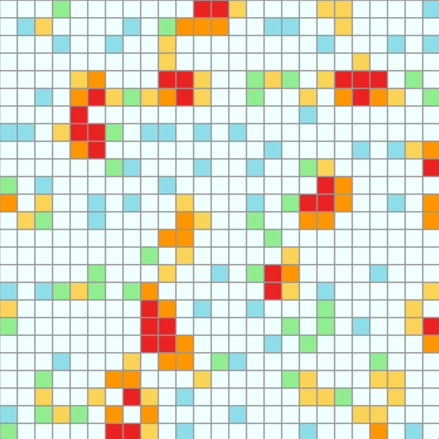

# Cellular automata

Pour tester le code, installer Processing et exécuter les fichiers .pde.

## Matinée : Exemples d'automates cellulaires et idée de projet individuel
J'ai cherché à coder entièrement un automate cellulaire en 2D sur la base du GameOfLife, puis d'ajouter du son sur Processing.

Pour avoir un exemple d'automate cellulaire en 2D, j'ai entièrement codé une version de GameOfLife. Ce fichier est disponible dans ce dossier sous le nom de "GameOfLife.pde".

## Après-midi : Suite du projet personnel
Pour avoir un automate personnalisé et original, j'ai changé les conditions d'évolution des générations de cellules de GameOfLife. Cela permet de ne pas arriver trop rapidement aux gliders.

L'idée reste similaire :
- si une cellule vivante est trop entourée ou trop peu : elle meurt ;
- si une cellule morte est entourée de 2 personnes, elle re-nait ;
- sinon, elle reste dans son état actuel.

Le projet d'aujourd'hui a un aspect plus scientifique que celui d'hier. Les cellules peu entourées sont de couleurs froides (bleu clair, vert clair...) et les cellules ayant plus de voisins sont de couleurs chaudes (rouge, orange...). Enfin, les cellules mortes, sont bleues/blanches.

Grâce à ce projet, on essaye de se rendre compte de la densité de la grille, autant visuellement que grâce au son. Ainsi, si une grille est assez dense (ie elle est plutot rouge ou orange), alors on entend un son aigu. Sinon elle produit un son plutôt grave.

*Remarque : L'idée originelle était d'avoir un son plutôt harmonieux, ce qui n'est pas vraiment le cas ici. Cela s'est avéré compliqué à réaliser, en si peu de temps. Cependant, la fonction env.play() m'a permis de faire des crescendos et decrescendos pour assurer une certaine harmonie.*

## Crédits
### IA :
ChatGPT a été utilisé pour ce code. *Rien n'a été généré par IA*. Cependant, je l'ai utilisé pour :
- les formules mathématiques de la boucle contenue dans la fonction countNeighbors ainsi que les bornes de cette boucle, qui a posé beaucoup de problèmes ;

- pour l'utilisation du son dans Processing. "Env" a été ajouté par IA ainsi que l'idée de convertir la "sum" en fréquence (au lieu d'une multitude de "if").