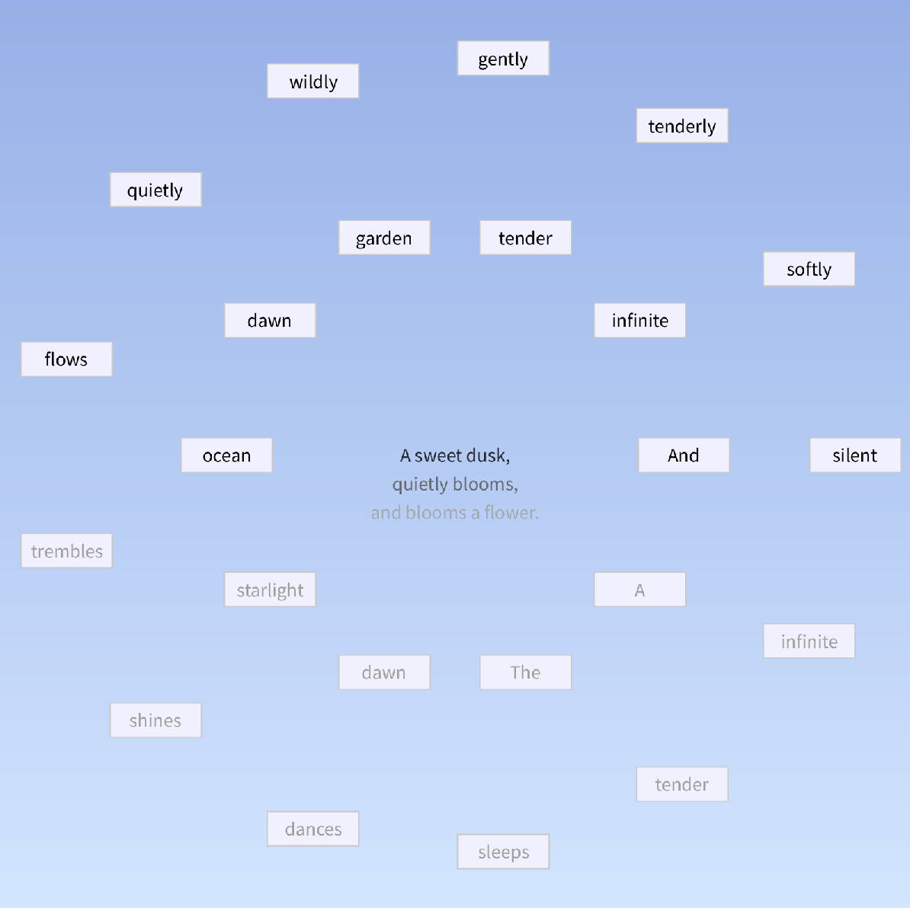

# Digital litterature

Pour tester le code, installer Processing et exécuter les fichiers .pde.

## Matinée : Recodage des Love Letters de Strachey

Pour le nouveau thésaurus, cette fois sur le thème de la haine, j’ai choisi de conserver l’anglais. Cela me permettait d’éviter la complexité de la conjugaison, beaucoup plus lourde en français.

## Après-midi : Suite du projet personnel

Idée de projet :
Sur la base des Love Letters, je voulais créer un dispositif dans lequel l’ordinateur génère un quatrain ou une sorte d’haïku à partir de listes de mots prédéfinis. Les mots non utilisés sont alors disposés autour du poème. L’utilisateur peut les drag-and-drop pour former ses propres phrases. Lorsque l’utilisateur modifie le poème, les mots du haïku généré automatiquement s’effacent pour laisser place à ceux choisis manuellement. En appuyant sur la touche espace, l’utilisateur peut générer une nouvelle sélection de mots et composer d’autres haïkus.

J’ai réalisé ce travail en anglais, encore une fois pour des raisons de simplicité linguistique : moins de variations, moins de déterminants, moins de contraintes grammaticales...

Pistes d’amélioration (à développer avec plus de temps) :
- Esthétique du poème : ajouter du mouvement (par exemple, des cercles ou mots en rotation) ;
- Poème central dynamique : mettre à jour automatiquement l’haïku central en fonction des compositions de l'utilisateur. C’est ce que je voulais réaliser à la base, mais le manque de temps et de technique n’a pas permis de le développer entièrement.

## Vendredi : amélioration

Finalement, j'ai choisi de simplifier certaines fonctionnalités pour stabiliser le projet et me concentrer sur l’interaction utilisateur. J’ai amélioré la détection des mots, le drag-and-drop et la mise en page générale du poème.
Même si j’ai appris comment fonctionnent certaines fonctionnalités de Processing, je dois admettre que ce rendu ne m’a pas du tout inspirée : c’est une production avec laquelle je n’ai pas accroché.

## Crédits
### IA

ChatGPT et Gemini ont été utilisés comme outils d’assistance, mais aucun texte ou code final n’a été généré automatiquement. J’ai utilisé l’IA pour :
- générer de nouvelles listes de mots pour l’algorithme de Strachey autour du thème de “la haine”, et comprendre comment mettre en forme le texte (80 caractères par ligne, comme dans les lettres originales) ;

- comprendre le principe du drag-and-drop dans Processing. En particulier, je n’avais pas pensé à associer chaque “carte” de mot à un tableau de coordonnées et à gérer le déplacement via des indices, j’utilisais uniquement des booléens auparavant ;

- méthode pour gérer le temps (avec un startTime et millis()).

### Inspirations

- Love Letters, Strachey

- Alcools, Apollinaire

- Inspirations Pinterest

## Camarades

Pour leurs explications concernant les dégradés et la fonction lerpColor.