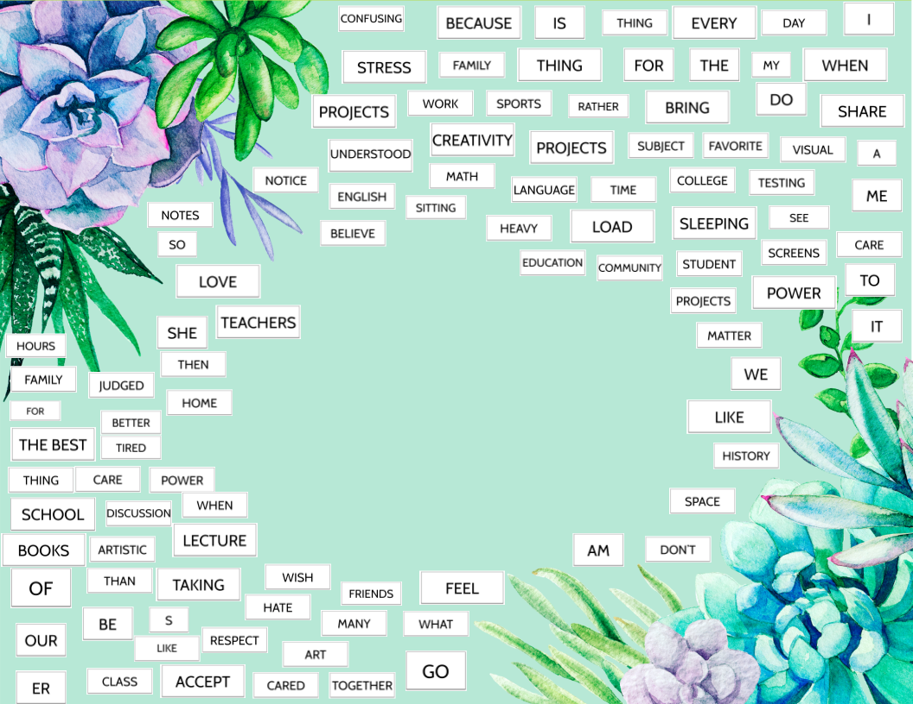

# Digital litterature

Pour tester le code, installer Processing et exécuter les fichiers .pde.

## Matinée : Recodage des "Love Letters" de Strachey
Pour le nouveau thésaurus, sur le thème de "la haine", j'ai choisi de garder l'anglais pour faciliter la conjugaison de la liste de verbes, plus simple en anglais.

## Après-midi : Suite du projet personnel
Idée de projet : Sur la base des "Love Letters", avoir des listes de mots prédéfinis puis faire générer à l'ordinateur un quatrain ou une sorte d'Haiku. Les mots non utilisés par l'ordinateur sont répartis autour du haiku. L'utilisateur a alors la possibilité de les drag-and-drop pour former des phrases personnels pour compléter le poème ou en créer un nouveau. Les mots du haiku s'effacent alors pour laisser place à ceux de l'utilisateur. Lorsque l'utilisateur appuie sur la touche "espace", la sélection des mots change et lui donne la possibilité de composer plus d'haiku.

Choix : j'ai choisi de faire ce travail en anglais, toujours pour éviter les problèmes liés à la conjugaison et aux déterminants.

Pistes d'amélioration, à explorer avec plus de temps :
- Côté esthétique du poème : ajouter du mouvement (les cercles tournent par exemple);
- Que l'haiku central se mette à jour en fonction des poèmes formés par l'utilisateur. C'était l'idée que je voulais mettre en oeuvre. Cependant, avec les contraintes de temps et d'apprentissage du langage Java, je n'ai pas encore pu le faire.

## Vendredi : amélioration
Finalement, j'ai choisi de ne pas 

## Crédits
### IA :
ChatGPT et Gemini ont été utilisés pour ce code. *Rien n'a été généré par IA*. Cependant, j'ai utilisé de l'IA pour :
- générer de nouvelles listes de mots pour l'algorithme de Strachey dans le thème de "la haine", ainsi que m'expliquer comment formater le texte (80 caractères par ligne comme ses "Love Letters");

- m'expliquer le principe du drag and drop et une méthode pour l'utiliser dans Processing. Particulièrement, je n'avais pas du tout pensé à créer un tableau de coordonnées pour chaque "carte" déplaçable et de gérer le drag avec des indices (j'avais fait ça avec des booléens).

### Inspirations :
- Love Letter, Strachey

- Alcool, Apollinaire

- Inspirations Pinterest

### Camarades :
- pour l'explication du dégradé de couleur et de la fonction lerpColor