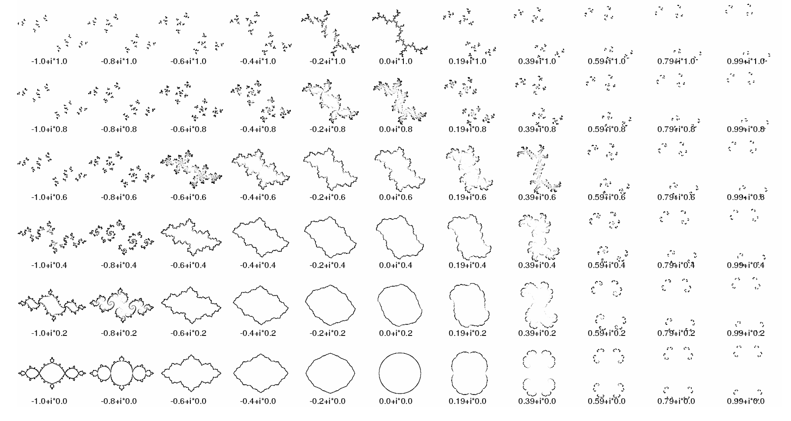
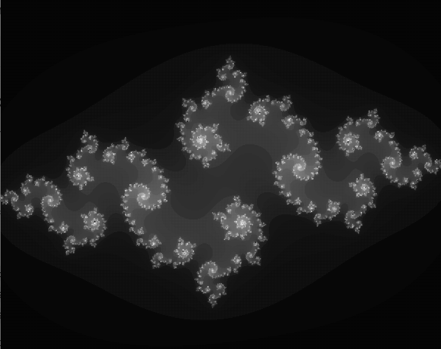

# Fractals

Pour tester le code, installer Processing et exécuter les fichiers .pde.

## Matinée : Exemples de codes de génération de fractales
Les fractales qui m'intéressent le plus sont les fractales de Julia. Cela m'intéraissait de faire un code assez mathématique et de comprendre les calculs sur les complexes de ce genre de fractale.
En parcourant des références et des cours, j'ai décidé de prendre le critère de Julia suivant : -0.8 + i*0.2

L'idée est de coder après avoir compis tout l'aspect mathématique pour générer une image esthétique (dans la forme et dans les couleurs). Un aspect dynamique sera peut-être ajouté ultérieurement.

## Après-midi : Suite du projet personnel
Le code, qui ne marchait pas avant la pause midi, a été retouché.

La fractale, initialement en nuance de gris, a été colorée. Deux versions sont cependant disponible dans ce dossier.
Les couleurs initiales étaient vraiment *trop* vives et assez aléatoires. Elles ont été changées. C'était surement le plus gros travail d'aujourd'hui.

Pour dynamiser la structure, j'ai choisi de faire varier le critère de Julia (c) au cours du temps. 

## Crédits
### IA :
ChatGPT a été utilisé pour ce code. *Rien n'a été généré par IA*. Tous les caluls mathématiques (l. 25, l. 31...) ont été posés par mes soins. Cependant, j'ai utilisé de l'IA pour :
- l'utilisation des complexes dans Processing. Je cherchais une fonction complex() ou quelque chose du genre, idé abandonnée pour finaleemnt maic=puler les parties imaginaires et réelles.

- dégradé de couleur, qui a pris beaucoup de temps : mode HSB plutôt que RGB.

### Cours en ligne et articles :
- https://mytino.itch.io/fractal-explorer : ispiration de certains codes disponibles ;

- https://math.univ-cotedazur.fr/~gachet/teaching/Fractales.pdf ;

- Blog "SuperProf"