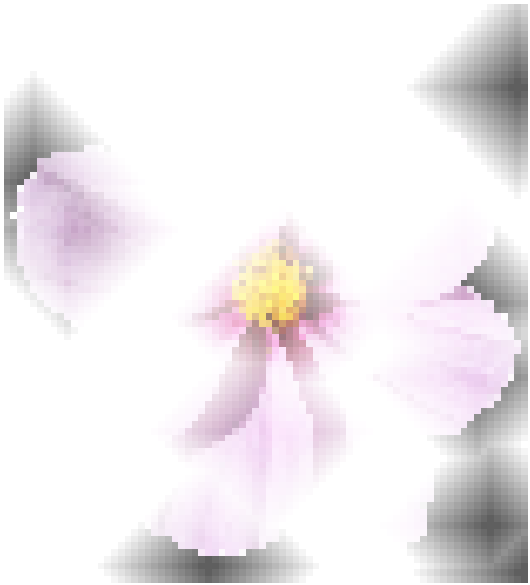
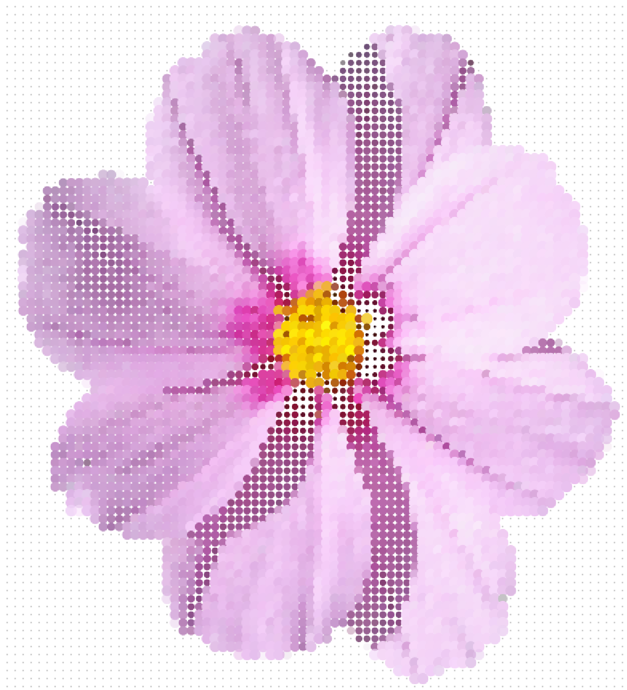
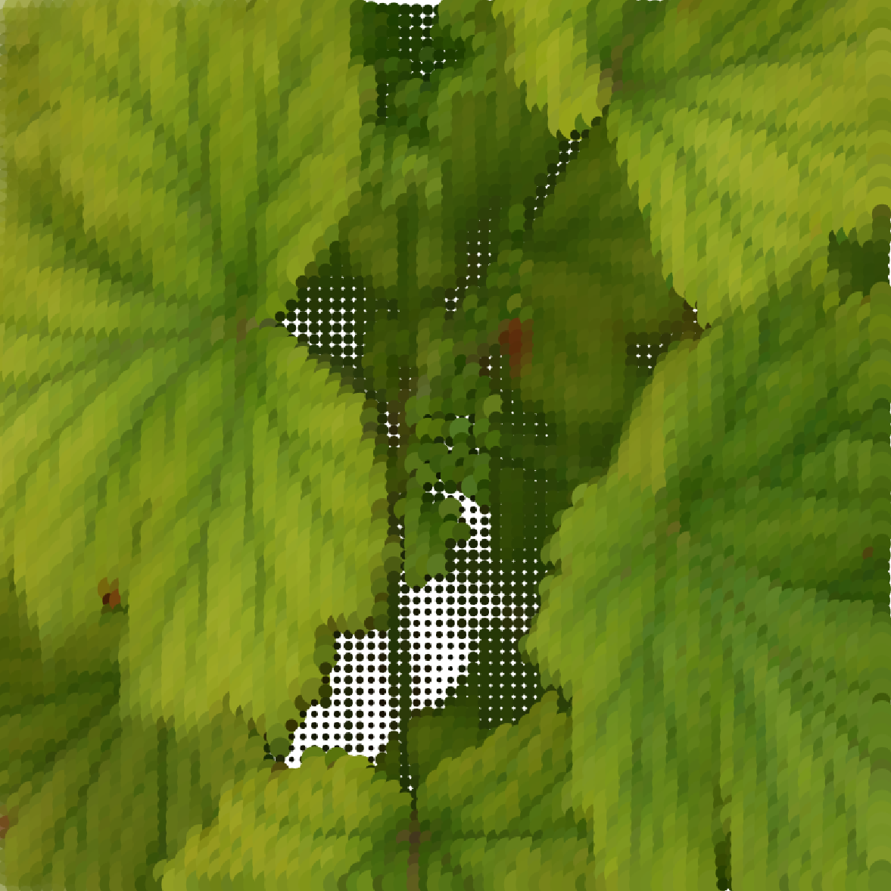
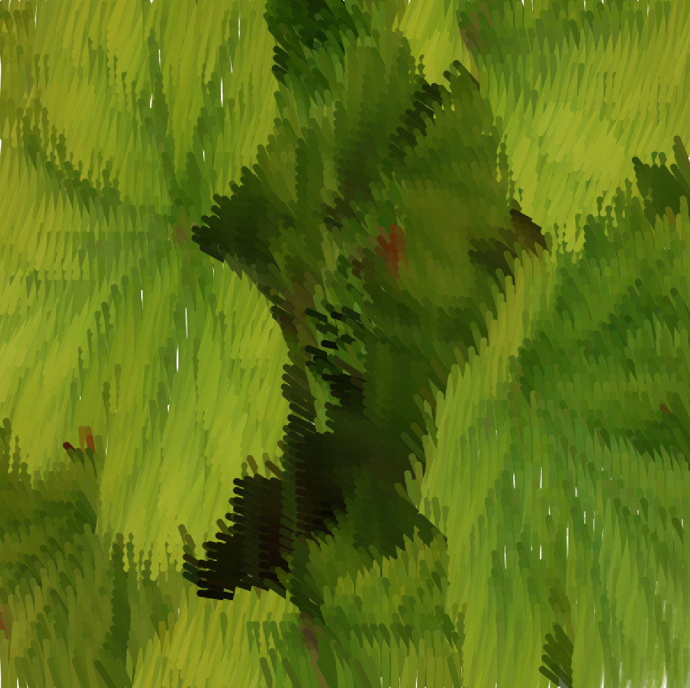

# Free project

Pour tester le code, installer Processing et exécuter les fichiers .pde.
Les photos utilisables sur ce projet sont disponibles dans le dossier "data". La ligne de code à changer pour visualiser les différentes photos est la ligne n°25.

## Idée de projet

Etant très sensible à la photographie et le dessin/peinture, j'ai voulu améner ceci dans ce workshop. L'idée à laquelle j'ai presque immédiatement pensée est la suite : un algorithme qui, à partir d'une photo, génère un dessin numérique, plus ou moins abstrait (point encore flou du projet).

Je voulais lier 2 projets que j'aime bien : le rendu du jour 1 avec les carrés de couleurs ; et le rendu du jour 2 : les automates cellulaires. En effet, ayant travaillé assez longuement sur les automates cellulaires lors du jour 2, j'ai décidé de partir sur ça : une photo est transformé en peinture assez abstraite numérique, presque mosaïque. Cela me permet de lier plusieurs passions et de les numériser.

### Principe :
On allume 10 cellules au hasard sur l'écran.
À chaque nouvelle génération, les cellules allumées activent leurs voisines directes.
Toutes les cellules actives ajustent leur teinte et leur luminosité pour ressembler à la photo. Jeu avec la luminosité pour avoir cet effet d'apparition progressive.

Version 1 (image quelconque : ici une fleur):
Ici, la fleur se créée.

Ici, elle est sous forme de mosaïque.

Une fois la partie technique du code ayant été réalisée, j'ai souhaité avoir un rendu final qui me plaisait plus.

J'ai essayé d'autres formes (triangles, ellipses...). Les ellispes m'ont beaucoup touchées. J'ai donc choisi de partir sur ce type de rendu visuel.

J'ai ensuite voulu avoir des ellipses de tailles diférentes. J'ai arbitrairement choisi d'avoir les ellipses de couleurs claires plus grandes que les couleurs foncées. Cela marchait sur mon image de fleurs mais peut-être pas sur d'autres. 

Alors j'ai ajouté de l'interactivité : si l'utilisateur appuie sur '+', les ellipses claires sont grandes. Si il appuie sur '-', ce sont les ellipses sombres.
Ce qui est intéressant avec ce nouveau paramètre est que l'on peut maintenant créer différentes textures et faire des images qui se détachent un peu plus de la photo originelle.

Enfin, j'ai cherché à avoir un rendu plus proche de la peinture (effet coup de pinceau) car j'y suis personnellement plus sensible. J'ai cherché à remplacer les ellipses par des lignes.

Pistes d'amélioration :
- changer automatiquement de photos lorsque l'on clique sur les flèches
## Crédits
### IA :
Gemini a été utilisé pour ce code. *Rien n'a été généré par IA*. Cependant, j'ai utilisé de l'IA pour :
- optimiser le code ;

- gérer la taille variable des ellipses et des lignes ;

### Inspirations :
- Mosaïques ;

- Sensibilité personnelle aux arts plastiques et visuels ;