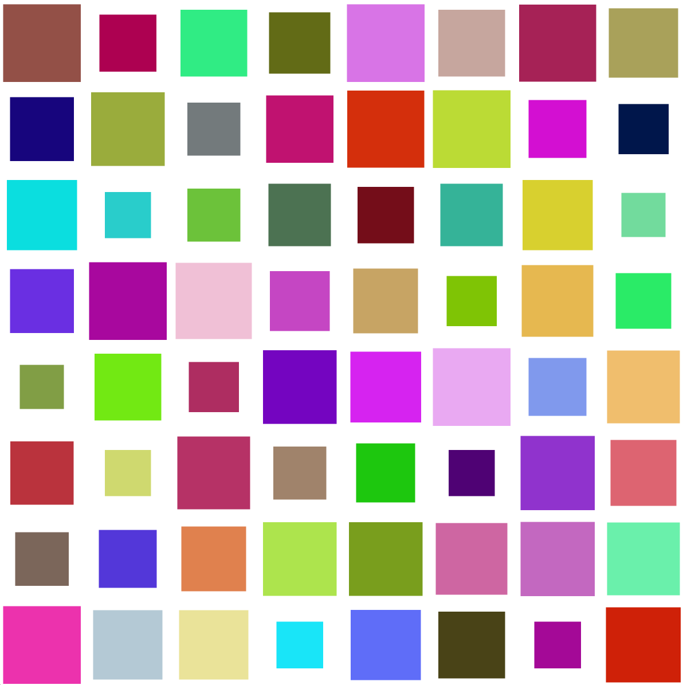

# Algorithmic Drawing

Pour tester le code, installer Processing et exécuter les fichiers .pde.

## Matinée : Exemples et prise en main de Processing
Réalisation de deux figures dans Processing : la figure "Lignes épaisses" ainsi que la figure n°5 du support de cours.
Elles ont d'abord été codées en noir et blanc avant l'ajout de la couleur pour la figure "Lignes épaisses".

J'ai souhaité animer la couleur. J'ai demandé à ChatGPT une méthode, d'où l'utilisation de l'offset. Le code n'a cependant pas été généré par IA.

## Après-midi : Projet personnel
Idée initiale : Sur la base d'oeuvres comme Neo Geo City ou encore les oeuvres les plus connues de Mondrian, créer une oeuvre interactive qui est une grille de carrés donc les tailles sont définis aléatoirement. Chaque carré aurait une couleur différente. Lorsque l'utilisateur clique sur un carré, la grille change de couleur.

Finalement, par question d'esthétisme, voici l'idée choisie : créer une oeuvre interactive qui est une grille de cellules (toutes ont la même taille) à fond blanc. A l'intérieur de chacune, un carré de couleur et taille aléatoire est placé.

Deux versions de cette oeuvre sont disponibles :
1) V1 : Lorsque l'utilisateur clique sur la grille, tous les carrés changent de couleur et de taille.
2) V2 : Lorsque l'utilisateur clique sur une cellule spécifique, uniquement celle-ci change de taille et de couleur. Ainsi l'utilisateur peut choisir l'harmonie du résultat.

## Crédits
### Inspirations : 
- Neo Geo City, Rafaël Rozendaal

- Travail de Piet Mondrian

- Travail de AARON de Harold Cohen, dans le choix de couleurs brutes et diverses

### IA :
ChatGPT a été utilisé pour ce code. Rien n'a été *généré* par IA. Cependant, je l'ai utilisé pour :
- certains calculs mathématiques (ex : float x = i * widthCell + (widthCell - widthSquare)/2 pour pouvoir centrer les carrés dans les cellules)
- certaines déclarations de variables que je ne connaissais pas dans Java (ex : float[][] sizes car je voulais utiliser des tableaux)